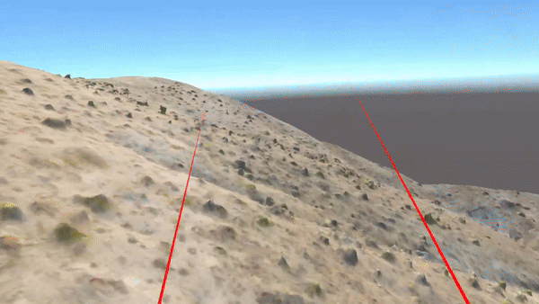
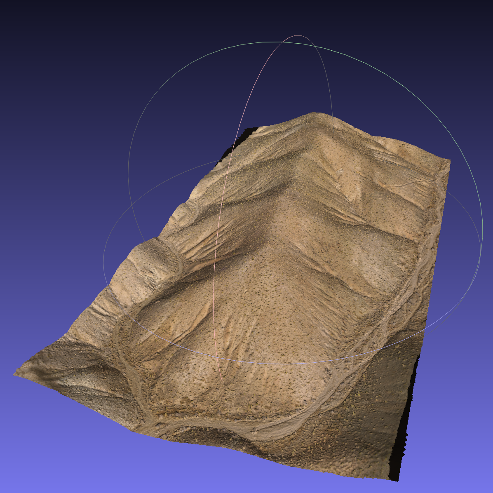

Samples
-----------------

VirtualRocks Unity Demo:
^^^^^^^^^^^^^^^^^^^^^^^^

.. figure:: media/twindemo.gif
   :alt: twin sisters in vr
   :height: 500 px
   :width: 1000 px
   :scale: 100 %
   :align: left

.. figure:: media/rockdemo.gif
   :alt: rock wall in vr 
   :height: 500 px
   :width: 1000 px
   :scale: 100 %
   :align: left

VirtualRocks Models:
^^^^^^^^^^^^^^^^^^^^

.. figure:: media/outcrop.png
   :alt: rock outcrop model
   :height: 500 px
   :width: 500 px
   :scale: 100 %
   :align: left

.. figure:: media/rock.png
   :alt: weathered basalt model
   :height: 500 px
   :width: 500 px
   :scale: 100 %
   :align: left

.. figure:: media/twin.png
   :alt: twin sisters model
   :height: 500 px
   :width: 500 px
   :scale: 100 %
   :align: left