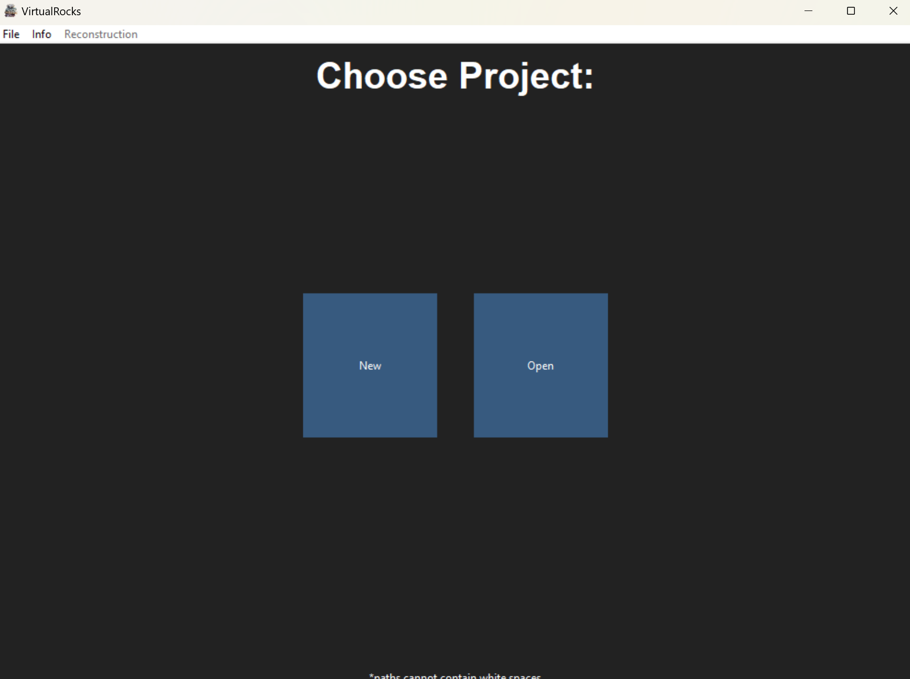

.. VirtualRocks documentation master file, created by
   sphinx-quickstart on Wed Jan 31 14:18:26 2024.
   You can adapt this file completely to your liking, but it should at least
   contain the root `toctree` directive.

VirtualRocks
========================================

**VirtualRocks** is a CS senior capstone project made over the course of the 2023/24
school year. It serves as a pipeline to turn a set of images into a set of tiled 3D meshes with 
high quality textures. 

**VirtualRocks Unity** is a partner virtual reality application created in Unity designed to view and 
navivate the very large models created by the VirtualRocks app using distance culling and shaders.

Getting Started
---------------
* Install the VirtualRocks application :ref:`here <Installation>`
* Create a new project inside a directory that will be used as the project workspace.
* Add your images, images should have a high degree of overlap with minimal background (we recomend between 100-500 images)
* Run matcher and mesher
* To veiw your models in VR visit :ref:`Unity installation <unity>`

Acknowledgments
---------------
* Twin Sisters and Mojave models created by Lyman Persico
* Weston Elgin Hw models created by Coden Stark
* Mt Carmel Junction model created by Morgan Sharp

.. toctree::
   :hidden:
   :caption: Contents:
   :maxdepth: 2

   FAQ
   Installation
   Samples
   unity
   dependencies
   reference/references
   license
   
----

Indices and tables
==================

* :ref:`genindex`
* :ref:`modindex`
* :ref:`search`
